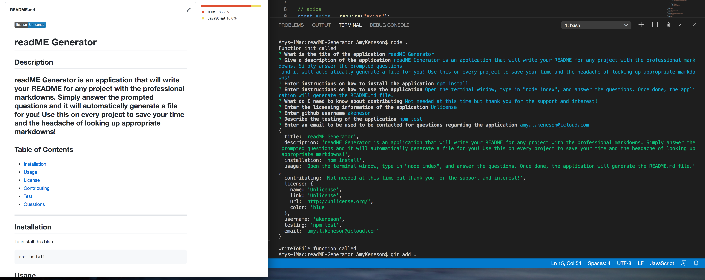

z
  
  [](http://unlicense.org/)

  

  # readME Generator
  ## Description
  readME Generator is an application that will write your README for any project with the professional markdowns. Simply answer the prompted questions and it will automatically generate a file for you! Use this on every project to save your time and the headache of looking up appropriate markdowns!
  
  ---
  ## Table of Contents

  * [Installation](#installation)
  * [Usage](#usage)
  * [License](#license)
  * [Contributing](#contributing)
  * [Test](#test)
  * [Questions](#questions)
 ---
 ## Installation
  To in stall this blah
  ```
  npm install
  ```

  ## Usage
  Open the terminal window, type in "node index", and answer the questions. Once done, the application will generate the README.md file.

  ## License
  readME Generator is Unlicense

  ## Contributing
  Not needed at this time but thank you for the support and interest!

  ## Test

  ```
  npm test
  ```

  ## Questions
  For questions regarding this application, please email: 
  amy.l.keneson@icloud.com


